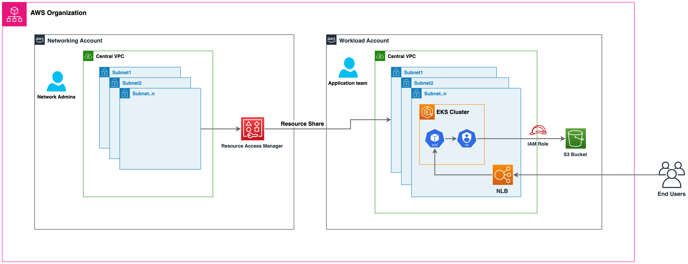
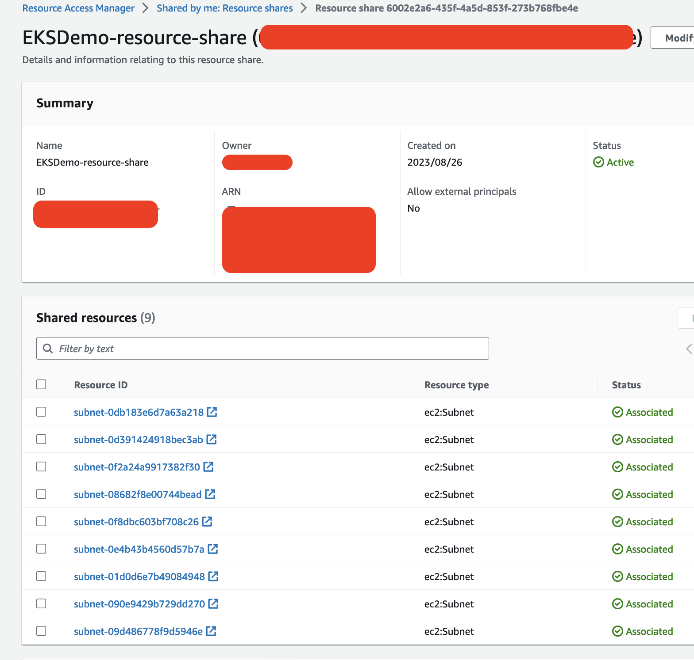
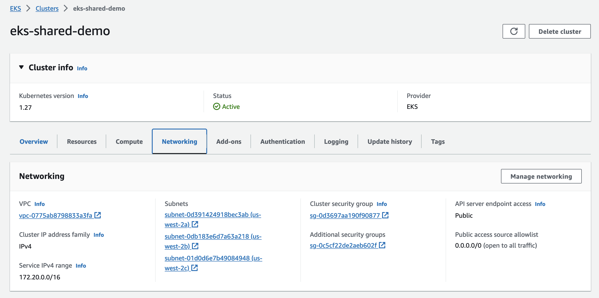

# Deploy Amazon EKS Clusters to Shared VPC Subnets Blog

In this walkthrough, we will demonstrate how can a central networking team in an enterprise can create and share the VPC Subnets from their own AWS Account with other Workload Specific accounts. So that, Application teams can deploy and manage their own EKS clusters and related resources in those Subnets.

## Solution Architecture



## Pre-requisites

* An AWS Organization setup with atleast 2 or more accounts. In this example we will use:
    - Central Network Account - To deploy networking resources like Amazon VPC, Subnet, etc.,
    - Workload Account to deploy Amazon EKS & application related resources
* export AWS_REGION=us-west-2
* [AWS CLI](https://aws.amazon.com/cli/) and credentails from both AWS Accounts, alternatively use [AWS CloudShell](https://docs.aws.amazon.com/cloudshell/latest/userguide/welcome.html#how-to-get-started)
* [eksctl](https://eksctl.io/) - a simple CLI tool for creating and managing Amazon EKS clusters
* [git](https://github.com/git-guides/install-git)
  ```shell
    git clone https://github.com/aws-samples/deploy-eks-to-shared-subnets-blog
    cd deploy-eks-to-shared-subnets-blog
  ```


## Central Networking Account Setup

### Deploy the VPC & RAM Resource

Run the below command to create a VPC, Public, Private and EKS Control plane subnets and share them with Workload Account using AWS Resource Access Manager (RAM).

```shell
aws cloudformation deploy --template-file assets/eks-vpc-cf.yaml --stack-name eks-demo --region $AWS_REGION --parameter-overrides Share2Principal=<<Your Workload Account Number or AWS Org/OU ARN>>
```

Wait for the CloudFormation template to complete, then export the below variables.

```shell
export EKS_VPC_ID=$(aws cloudformation describe-stacks --stack-name eks-demo --region $AWS_REGION --output text --query 'Stacks[0].Outputs[?OutputKey==`EKSDemoVPC`].OutputValue')
export EKS_CPSUBNET1_ID=$(aws cloudformation describe-stacks --stack-name eks-demo --region $AWS_REGION --output text --query 'Stacks[0].Outputs[?OutputKey==`CPSubnet1`].OutputValue')
export EKS_CPSUBNET2_ID=$(aws cloudformation describe-stacks --stack-name eks-demo --region $AWS_REGION --output text --query 'Stacks[0].Outputs[?OutputKey==`CPSubnet2`].OutputValue')
export EKS_CPSUBNET3_ID=$(aws cloudformation describe-stacks --stack-name eks-demo --region $AWS_REGION --output text --query 'Stacks[0].Outputs[?OutputKey==`CPSubnet3`].OutputValue')
export EKS_PRVSUBNET1_ID=$(aws cloudformation describe-stacks --stack-name eks-demo --region $AWS_REGION --output text --query 'Stacks[0].Outputs[?OutputKey==`PrivateSubnet1`].OutputValue')
export EKS_PRVSUBNET2_ID=$(aws cloudformation describe-stacks --stack-name eks-demo --region $AWS_REGION --output text --query 'Stacks[0].Outputs[?OutputKey==`PrivateSubnet2`].OutputValue')
export EKS_PRVSUBNET3_ID=$(aws cloudformation describe-stacks --stack-name eks-demo --region $AWS_REGION --output text --query 'Stacks[0].Outputs[?OutputKey==`PrivateSubnet3`].OutputValue')
```

Verify the values are properly exported

```shell
echo $EKS_VPC_ID $EKS_CPSUBNET1_ID $EKS_CPSUBNET2_ID $EKS_CPSUBNET3_ID $EKS_PRVSUBNET1_ID $EKS_PRVSUBNET2_ID $EKS_PRVSUBNET3_ID
```

We successfully created the VPC level resources and shared them with the Workload Account, you can verify them in the AWS RAM console as shown below:



This completes the setup in Networking Account, lets proceed with deploying Amazon EKS resources in Workload Account

## Workload Account Setup

Configure the AWS CLI to point to Workload account, verify the AWS Account number by following command:

```shell
aws sts get-caller-identity --query 'Account' --output text
```

Run the below commands to export the correct order of SubnetIds as defined in Workload Account.

```shell
export EKS_SUBNET1_ID=$(aws ec2 describe-subnets --subnet-ids $EKS_CPSUBNET1_ID $EKS_CPSUBNET2_ID $EKS_CPSUBNET1_ID --region $AWS_REGION --output text --query "Subnets[?AvailabilityZone==\`${AWS_REGION}a\`].SubnetId")
export EKS_SUBNET2_ID=$(aws ec2 describe-subnets --subnet-ids $EKS_CPSUBNET1_ID $EKS_CPSUBNET2_ID $EKS_CPSUBNET2_ID --region $AWS_REGION --output text --query "Subnets[?AvailabilityZone==\`${AWS_REGION}b\`].SubnetId")
export EKS_SUBNET3_ID=$(aws ec2 describe-subnets --subnet-ids $EKS_CPSUBNET1_ID $EKS_CPSUBNET2_ID $EKS_CPSUBNET3_ID --region $AWS_REGION --output text --query "Subnets[?AvailabilityZone==\`${AWS_REGION}c\`].SubnetId")
```

### Deploy the EKS cluster and Managed Nodegroup

```shell
cat << EOF > eksctl.yaml 
apiVersion: eksctl.io/v1alpha5
kind: ClusterConfig
metadata:
  name: eks-shared-demo
  region: $AWS_REGION
  version: "1.27"
iam:
  withOIDC: true
vpc:
  id: $EKS_VPC_ID
  subnets:
    private:
      ${AWS_REGION}a:
        id: $EKS_SUBNET1_ID
      ${AWS_REGION}b:
        id: $EKS_SUBNET2_ID
      ${AWS_REGION}c:
        id: $EKS_SUBNET3_ID
addons:
  - name: vpc-cni
  - name: coredns
  - name: kube-proxy
    
managedNodeGroups:
  - name: eks-shared-demo-mng
    instanceType: m6a.large
    privateNetworking: true
    subnets:
      - $EKS_PRVSUBNET1_ID
      - $EKS_PRVSUBNET2_ID
      - $EKS_PRVSUBNET3_ID
    minSize: 2
    desiredCapacity: 2
    maxSize: 5
EOF
```

Verify the variables are properly substituted in the `eksctl.yaml`

Launch the cluster and managed node group by running the following command:

```shell
eksctl create cluster -f eksctl.yaml
```

In about 10-20 minutes, cluster and nodegroup will be up & running in workload account. You can login to AWS console and verify the same.



### Deploy sample workload

Create IAM OIDC Provider

```shell
eksctl utils associate-iam-oidc-provider --cluster eks-shared-demo --approve
```

Create an IAM Role for Service Account (IRSA) so that application pods can assume the role and access AWS resources like Amazon S3 buckets, Amazon Dynamodb tables, etc.,

```shell
eksctl create iamserviceaccount --name s3-readonly-role --namespace default \
--cluster eks-shared --role-name s3-readonly-role \
--attach-policy-arn arn:aws:iam::aws:policy/AmazonS3ReadOnlyAccess --approve

kubectl run flask-s3-read --image sriram430/flask-s3-read \
--overrides '{"spec":{"serviceAccount":"s3-readonly-role"}}'
```

Expose the application pod via k8s service type LoadBalancer, default in-tree controller running in EKS will create a Network LoadBalancer (NLB) in public subnets shared by the Central Networking Account.

*Note* It is recommended to use [AWS Load Balancer Controller](https://kubernetes-sigs.github.io/aws-load-balancer-controller/) to create Amazon Network LoadBalancer, Application LoadBalancer resources. For simplicity, we are using the in-tree controller.

```shell
kubectl expose pod flask-s3-read --type LoadBalancer --port 80 --target-port 5000 \
--name flask-s3-svc \
--overrides '{"metadata":{"annotations":{"service.beta.kubernetes.io/aws-load-balancer-type":"nlb"}}}' 
```


Verify the NLB is up and running. run the curl command to validate if the pod is able to assume IAM role to list the s3 buckets in Workload AWS Account.

```shell
kubectl get svc flask-s3-svc
NAME           TYPE           CLUSTER-IP       EXTERNAL-IP                                                                     PORT(S)        AGE   SELECTOR
flask-s3-svc   LoadBalancer   172.20.154.148   a1ac3b0ccb7d044ecbb6c71ebf2bb2a5-ff8d1ad93d0488fb.elb.us-west-2.amazonaws.com   80:31583/TCP   53s   run=flask-s3-read
```

```shell
curl http://a1ac3b0ccb7d044ecbb6c71ebf2bb2a5-ff8d1ad93d0488fb.elb.us-west-2.amazonaws.com/list-buckets

[list of s3 bucket names in the account]
```

YAY!! We are able to successfully share the VPC Subnets from Central Networking account and deploy the EKS Cluster & sample application in Workload account.

## Clean up

### Workload Account

```shell
# Delete workload
kubectl delete svc flask-s3-svc
kubectl delete pod flask-s3-svc
eksctl delete iamserviceaccount --cluster eks-shared-demo --name s3-readonly-role

# Delete EKS Cluster
eksctl delete cluster -f eksctl.yaml
```

### Central Networking Account

```shell
aws cloudformation delete-stack --stack-name eks-demo --region $AWS_REGION
```

## Security

See [CONTRIBUTING](CONTRIBUTING.md#security-issue-notifications) for more information.

## License

This library is licensed under the MIT-0 License. See the LICENSE file.
